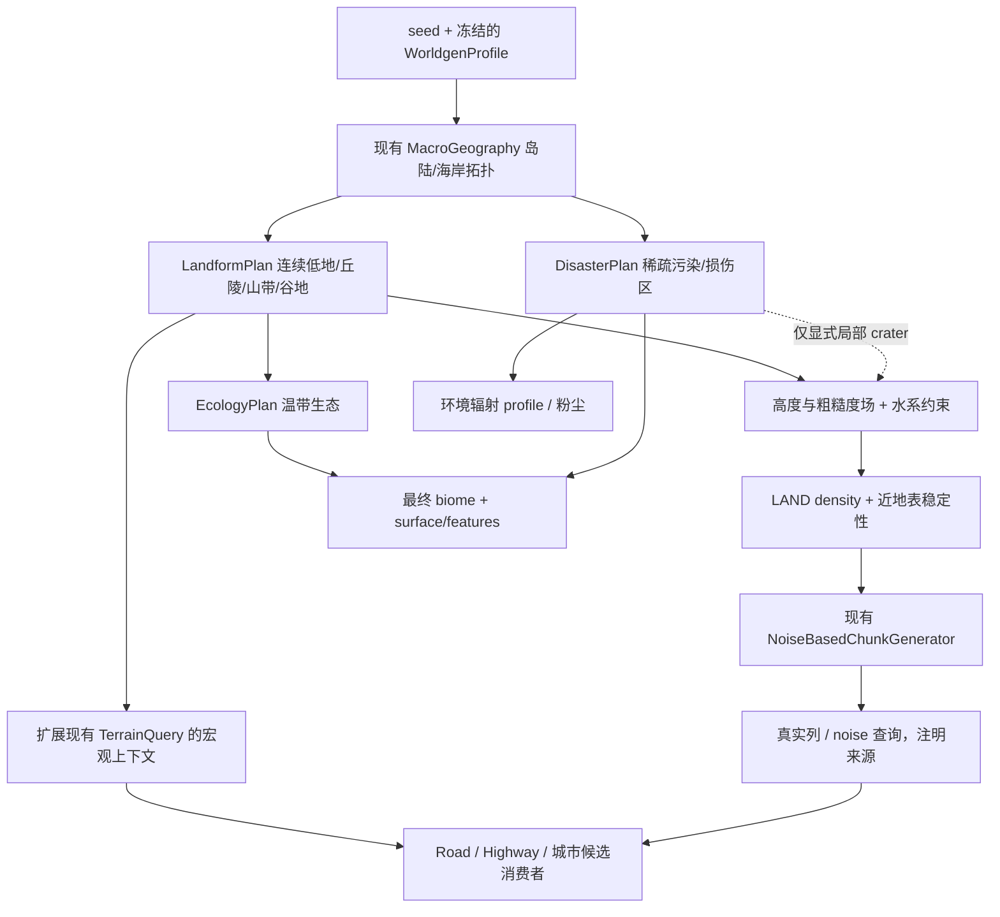
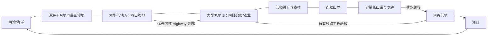

# 哥伦比亚联邦 Terrain V2：现实地貌研究与重构设计

日期：2026-10-07。状态：**RESEARCH / DESIGN ONLY；未实施，未实机验证**。

2026-10-10 补充：本文 §2 的现实依据是定性的，§6 的数值都是设计假设。真实 DEM 的定量统计、新的地貌规划和这些假设的对照，见 [Terrain V2 真实地貌研究与规划 r1](terrain_v2_real_terrain_research_v1.md)：例如中西部平原 0.5 km² 河网的河道间距实测中位数 655–990 m，分水岭离河高 4–14 m；本文的生成链审计（§3）抽查属实，稳定层（§8）、世界高度结论 B（§7）和三层分离原则继续有效。

本报告依据当前仓库、Minecraft 1.20.1 / Forge 47.4.22 的本地 mapped 源码及下列公开官方资料。只新增/同步文档，没有修改 Java、JSON、存档或生成参数，没有运行 Gradle、客户端或世界生成测试。用户报告的道路失败是重要问题输入，但不是本轮采样统计。

**审计起因：用户已实际测试，道路 V1-B 当前实机验收失败（USER-REPORTED FAIL），不是尚未开始验收。** 用户报告大量浅层空洞、坡度/削填拒绝及连续可建低地不足，因此要求本次 Terrain V2 审计。失败状态已确认；各失败样本的机制贡献仍需坐标化诊断，二者不可混淆。

命名说明：历史文档 [Terrain V2 Phase 1 / Macro Geography V1.1](terrain_v2_macro_geography_v1.md) 已使用过 Terrain V2 名称；其中 `MacroGeography.VERSION=3` 指现行岛国拓扑。**本文是新的“哥伦比亚联邦 Terrain V2”设计，不表示旧文档中的地形已经被替换，也不将新 terrain 版本号等同于岛屿 topology 版本。** 后续实施边界见 [迁移计划](terrain_v2_migration_plan.md)。

## 1. 结论与证据边界

建议进行范围受控的大重构：重新建立连续陆地地貌场、可建设低地、近地表稳定层，以及生态和灾难的独立分布。**保留 NoiseBasedChunkGenerator、现有主岛/三卫星岛拓扑、Highway 规划与工程核心、Road V1-A/V1-B、StructureTransform/StructureSocket/SpatialClaim。** 不需要新写 ChunkGenerator，也不能靠降低一个噪声振幅或放宽道路拒绝条件完成目标。

当前根因可分成三个已确认的机制：

1. “平原占主导”目前主要是 continentalness/erosion 输入重映射，不是连续低地高程、坡度、粗糙度的输出约束。完整 vanilla `base_3d_noise`、ridges/jaggedness、noise caves 与后续 carvers 仍可影响最终表面。没有面向城市的近地表稳定层。
2. 主国陆地最后被区域规划强制选为 Fallout Barrens，只有出生区和少数小 Plains pockets 例外。恢复森林仅添加 biome JSON 或调整 TerraBlender 权重无效。
3. 道路的真实方块预检默认拒绝地面以下约 6 层内任一空气格；Survey 的未加载区估算不能证明这一条件。保守拒绝、自然空洞、噪声/真实区块差异、固定路口高程约束必须分别诊断。

**尚未证明**：全国浅洞面积占比、哪种 cave 对特定截图贡献最大、高频噪声在最终 Y 上的具体振幅、当前 32 格道路真实通过率。本轮没有获得对应 seed/坐标/完整 Survey 报告，也没有生成或扫描世界；不把“代码存在这种机制”写成“已测得它造成全部失败”。

## 2. 国家地理与现实研究方法

国家定位：温带、工业化、平原占主导的虚构岛国。借用不同现实地区的地貌组织方式，不复制州界、城市位置或一比一高程。森林是生态，农业是土地利用，辐射是环境覆盖；三者都不应自动意味着崎岖地形。

### 2.1 官方资料来源表

| 类型 / 来源 | 年份与地区 | 本轮使用目的、观察与尺度 | 派生设计结论（不是官方 AFL 参数） |
| --- | --- | --- | --- |
| 官方生态地图：[EPA/USGS Ecoregions of Indiana and Ohio](https://dmap-prod-oms-edc.s3.us-east-1.amazonaws.com/ORD/Ecoregions/oh/ohin_eco_lg.pdf) | 图版 1998；Ohio / Indiana | 1:1,500,000，标尺到 120 km。中央玉米带平原、湖滨平原与东南部高原有区域连续性；Columbus、Dayton、Indianapolis 等城市可在同一宏观低地背景中比较 | 主岛以连续低地和渐变丘陵组织，而非每个小 biome 独立造山；不能由这张生态图计算城市地面 32 m 坡度 |
| 官方生态报告：[EPA Regionalization of the Upper Midwest](https://nepis.epa.gov/Exe/ZyPURL.cgi?Dockey=2000IBN4.TXT) | 本轮未核定原报告出版年；上中西部 | 冰川平原、农业与林地、地形和生态区的区域性联系；定性阅读，无栅格统计 | 平缓低地可以同时容纳农业、森林和城市；不把农业地表直接等同于全部自然平原 |
| 官方地貌图：[ISGS / UIUC Physiographic Divisions of Illinois](https://resources.isgs.illinois.edu/maps/physiographic-divisions-illinois)；[GIS 服务](https://data.isgs.illinois.edu/arcgis/rest/services/Geology/Physiographic_Regions/MapServer) | 原始分类 Leighton 等 1948；GIS 数字化资料为 1993；Illinois | Chicago Lake Plain、Kankakee Plain、Springfield Plain、Bloomington Ridged Plain 等分区表明“平原”内部有湖积平原、冰碛脊和切割程度差异 | 大低地里保留低频脊和浅谷；名称不代表整个区域等高。没有从此图测出高程波长 |
| 官方地貌图：[Pennsylvania DCNR Map 13](https://elibrary.dcnr.pa.gov/PDFProvider.ashx?PromptToSave=False&Size=2825389&ViewerMode=2&action=PDFStream&chksum=&docID=1752507&docName=Map13_PhysProvs_Pa&nativeExt=pdf&overlay=0&revision=1)；[Landforms](https://www.pa.gov/agencies/dcnr/conservation/geology/geology-of-pa/landforms) | 2000 第四版，2023 第三次印刷；Pennsylvania | 图幅 1:2,000,000。高原、连续脊谷和山麓；图例局部起伏等级 very low 0–100 ft、low 101–300、moderate 301–600、high 601–1000、very high >1000 | 借用连续山带与长谷；这些是区域分级，**不是某 32/1024 m 样方测量**，不直接换成游戏噪声振幅 |
| 官方州级报告：[Virginia DCR James Scenic River Report](https://www.dcr.virginia.gov/recreational-planning/document/srreportjamesriver.pdf) | 2019；Virginia James River | 可检索官方文本描述 Piedmont、Fall Line 与沿海平原的过渡；本轮 PDF 完整读取受访问限制 | 河谷从内陆丘陵通向沿海低地和河口；不声称已测量谷宽或坡度 |
| 官方沿海资料：[NOAA Chesapeake Bay Virginia Reserve](https://coast.noaa.gov/nerrs/reserves/chesapeake-bay-va.html) | 网页未标数据调查年；保护区设立于 1991（不是数据年份）；York River 流域 | 潮汐湿地、泥滩、浅滩及盐度梯度；网页给出保护区潮差约 0.9 m，不能外推整个岛国 | 海岸应有河口/湿地与稳定陆上台地；港口适宜地不能简单取“离海最近的湿地” |
| 官方工程手册：[FHWA PDDM Chapter 9](https://highways.fhwa.dot.gov/federal-lands/pddm/Chapter_09.pdf) | 2012-08；公路设计通则 | §9.3.1.3 的走廊地形分类：level 通常 ≤1:20，rolling 介于 1:20 与 1:3，mountainous >1:3；这是**地形分类而非公路最大纵坡** | 低地提供连续走廊；山地区域也可利用局部谷地。不用该表为 AFL 1/16 或 1/8 宣称现实认证 |
| 官方工程手册：[FHWA Geotechnical Aspects of Pavements, Chapter 8](https://www.fhwa.dot.gov/engineering/geotech/pubs/05037/08.cfm) | 2005；工程地基与土方 | 平地与山区的挖填需求不同，需检查地基、材料及土方平衡 | 保留有限工程预算和稳定性预检；没有统一适用于全国的“常见挖填必为 X 米” |
| 官方 DEM 数据说明：[USGS elevation datasets FAQ](https://www.usgs.gov/faqs/what-types-elevation-datasets-are-available-what-formats-do-they-come-and-where-can-i-download) | 数据年份随 tile；美国 | 检索确认 3DEP 约 10 m（1/3 arc-second）及局部 1 m 产品；网页部分访问失败 | 可作为后续少量样方的数据源；**本轮没有下载 DEM、计算坡度/频谱或统计谷宽** |
| 官方土地覆盖：[USGS Annual NLCD fact sheet 2025-3001](https://pubs.usgs.gov/fs/2025/3001/fs20253001.pdf) | 2025 说明文档；所述首发序列 1985–2023、2024 发布 | 识别年份和土地覆盖观测口径；本轮仅使用资料说明，不分析栅格 | 后续用同年覆盖数据区分水域、林地、耕地、建成区；本报告的面积比例不是 NLCD 实测值 |

资料访问日期为 2026-10-07。地图年份不等于网页抓取日期。未使用或提交卫星影像、第三方地图副本或大型 DEM；访问失败即停止该入口，没有绕过限制。下面的数值均为游戏设计建议，不能引用为 USGS/EPA 的测量结果。

### 2.2 地区比较与指标提取

| 参考地区 | 可借用的关系 | 不应照搬的部分 |
| --- | --- | --- |
| Ohio 中西部 | 连续低地、缓丘、河谷和林农交错适合大都市及交通网络；东南丘陵构成清晰的区域变化 | Ohio 不是全州平地；现实城市发展还受产业、运输和历史影响，地形不是唯一原因 |
| Illinois / Indiana | 大尺度农业平原与湖滨低地，适合作为城市扩展、物流及工业走廊的形态参考 | 不把冰碛平原简化成零起伏平板，不把真实纬度气候完整移植到游戏 |
| Pennsylvania | 连续森林丘陵、山脊与长河谷，为工业小镇、矿区和山地边缘提供层次 | 不把全国变成 Appalachian 山区，也不以山地名义引入永久雪山 |
| Virginia / Mid-Atlantic | 海岸低地—河口湿地—Piedmont—山麓的过渡适合岛国港口和腹地联系 | 不把潮间带当普通可建设地；港口水深、防洪和岸线工程仍是未来专项 |

十五项指标的完成边界：

| 指标 | 已获得的证据 | AFL 派生方法 / 未完成项 |
| --- | --- | --- |
| 1 城市周边连续尺度 | 州级地图显示同一低地横跨多个城市，远大于街区 | 转译为 1–3k 格连续区；没有实测各城市可建面积 |
| 2 平原高度变化 | 低起伏区域分类存在，但不是城市 DEM 样方 | 用去趋势粗糙度和 P95–P5 验收，目标见 §6 |
| 3 缓丘周期 | 地貌分区支持成片起伏而非随机尖峰 | 周期 256–1024 格为设计假设，未测真实频谱 |
| 4 河谷宽度 | PA 脊谷、James 河谷支持长向组织 | 谷底 128–512 格为设计假设；实际河宽与谷宽分开 |
| 5 山地/低地关系 | PA 地貌省与 VA 山麓过渡 | 山地集中在 1–2 带，与低地间留渐变山麓 |
| 6 Highway 常见地貌 | FHWA 区分平地、丘陵、山地走廊 | 优先低地/谷地；跨山另做工程，不将所有坡削平 |
| 7 城市选址 | 地图可比较地貌背景，不能证明单一历史因果 | 低坡、连片干地、交通可达共同评分 |
| 8 工业地形 | 土方和地基资料支持连续稳定地面价值 | 规则地块、物流连接、低水风险；不是“所有工业都在平原” |
| 9 港口地形 | NOAA 河口形态和陆水交错 | 干台地接近深水通道；海岸接近性不能替代地基条件 |
| 10 农业地形 | EPA / ISGS 连片农业低地 | 农业是聚落/用途覆盖，不新增专用造山 biome |
| 11 林地与平原过渡 | 生态区显示林农交错 | 林地可覆盖低地或丘陵；地表平缓不要求无树 |
| 12 水体比例 | NLCD 提供未来观测办法；未计算比例 | 主岛外岸包络内的水面作为分母口径，排除无边大洋 |
| 13 湿地/河口 | York River 潮汐形态资料 | 河口沿排水路径展开，湿地受低程和水系限制 |
| 14 丘陵密度 | 区域分类支持成带分布 | 约 20% 干陆缓丘为参考，非官方实测比例 |
| 15 山地连续尺度 | PA 图示长脊、谷及高原分区 | 单带数千格长；不以几十格高频噪声拼接“山地” |

后续若需要实测校准，限定 Ohio 中西部、Illinois/Indiana 平原、PA 脊谷、VA 河口各一小块约 10–20 km 样方：同一垂直基准的 DEM、同年 land cover，记录无效值/水面；分别计算去趋势起伏、多个窗口坡度、低地连通面积。不得把 10 m DEM 插值成可靠 1 m 微地形，也不得用平原与山区混合平均掩盖局部条件。这是可选研究后续，**不是本轮结果或开工阻塞项**。

### 2.3 对公路的具体启示

公路不是无条件沿某条等高线：平面线形、纵坡、排水、视距、地基、占地和土方成本共同决定路线。低地允许更直接的走廊，缓丘可利用山麓与宽谷，山地中常需绕行、切坡、填筑或桥隧。跨河、深谷和软弱湿地需要专门判断，不能仅因为高差大就自动加桥。

AFL 无需模拟真实工程。地形应首先提供宽而连续的可建走廊；普通道路保留 3 格削填和 1/16 纵坡约束，超过预算就拒绝/换候选。山地战略道路和复杂跨谷设施是后续内容。地形调整提升候选成功率，不能当成 Survey/Preview 一致性缺陷已解决。

## 3. 当前生成链路审查

本节路径以 `src/main/java/com/antaurora/apofirstlight/`、`src/main/resources/` 为根；均指当前实际调用链，不只按文件名推断。

### 3.1 岛国拓扑：保留价值高

来源：[MacroGeography.java](../../src/main/java/com/antaurora/apofirstlight/worldgen/geography/MacroGeography.java)、[MacroGeographySample.java](../../src/main/java/com/antaurora/apofirstlight/worldgen/geography/MacroGeographySample.java)。

| 当前事实 | 判断 |
| --- | --- |
| 拓扑版本 3；按 seed 缓存最多 16 个不可变计划 | 保留种子确定性及有界缓存思想；地形新版本另设 |
| 主岛基础椭圆半长轴 7300–8200、半短轴 5700–6300，带旋转 | 基础轴向直径约 14600–16400、11400–12600 格；**不是固定 X/Z 包围盒**，岸线扰动后实际范围要按 seed 采样 |
| 主陆核心半径 3800；出生干陆预留 384；海岸混合宽度 48；海平面 63 | 拓扑干陆不等于最终地表没有水洼/浅洞，不等于可建平台 |
| 岸线含 3/5/9 次角度扰动与半岛项；1–3 个海湾，深约 400–600；可选内海需满足陆环约束 | 保留国土轮廓语法，不以陆地高程重构为由重做海湾和海峡 |
| 固定 3 座卫星岛，半轴约 550–750 / 400–500，岛间岸距设计约 400–500；具有 bank 与 crossing metadata | 保留 ID/角色/桥接候选；桥头最终地形资格仍须重新验收 |
| `coastDistance` 为解析近似距离场 | 可作渐变和候选指标，不当精确最近岸线测距 |
| `surfaceHeight` 在 LAND 上仍能算出历史解析高度 | **不是当前陆地最终高程，也不是 Highway 的陆地高度来源**；新 API 必须明确 reference 与实测的区别 |

主岛半长轴公式为 `7300 + unit*900`；上述为随机参数的边界范围，不表示每个端值一定取到。具体 seed 的实际国土边界最终以宏观采样输出为准。国土约万格级足以容纳多个千格低地，但不应承诺随意放下几十座 2048² 完整城市。

### 3.2 陆地最终高度：为什么“平原参数”仍会破碎

来源：[LandTerrainRelief](../../src/main/java/com/antaurora/apofirstlight/worldgen/geography/LandTerrainRelief.java)、[LandTerrainBias](../../src/main/java/com/antaurora/apofirstlight/worldgen/geography/LandTerrainBias.java)、[InlandElevationBias](../../src/main/java/com/antaurora/apofirstlight/worldgen/geography/InlandElevationBias.java)、[RandomStateSeedMixin](../../src/main/java/com/antaurora/apofirstlight/mixin/RandomStateSeedMixin.java)、[Overworld noise settings](../../src/main/resources/data/minecraft/worldgen/noise_settings/overworld.json)。

实际链路：

```text
seed + 原始 continents / erosion
  → LandTerrainBias 重映射 C/E
  → vanilla TerrainProvider offset / factor / jaggedness splines
  → depth = Y 梯度 + offset + InlandElevationBias
  → slope = 4 × quarterNegative((depth + jagged项) × factor)
             + 完整 vanilla base_3d_noise
  → macro_caves：entrances / spaghetti / cheese / pillars / noodle
  → MacroTerrainDensity 的陆海混合
  → vanilla NoiseBasedChunkGenerator 填充 / aquifer / surface / carvers / features
```

这里的箭头是依赖示意，surface/carvers/features 的实际阶段仍以原版 chunk pipeline 为准，不能将它们视为全部包含在 `getBaseHeight` 里。

- C/E 决定地形样条族；ridges、folded ridges、jagged noise 仍参与。完整内陆 Plains 的 C 基底约 0.24–0.32、E 约 0.61–0.65，并不是最终高度或坡度界限。
- 核心 rolling 门控当前乘 **0.30**，外主岛逐步到 1；卫星岛 0.50。高地/山地仅在外主岛启用。旧文档的核心 0.65 已过时，本轮按源码修正文档。
- `InlandElevationBias` 最大 0.046875，对孤立线性 depth 项约等效 +6 格；完整三维噪声与洞穴没有一起平移，不能据此推导每列最终表面必升 6 格。
- `base_3d_noise_scaled.json` 虽然存在 0.20 乘数，但当前 `macro_sloped_cheese` 使用完整 `minecraft:overworld/base_3d_noise`，不能把未接入资源视为已限幅。
- `initial_density_without_jaggedness` 不是最终实体密度；它没有完整 base 3D/caves，地下生态判据与 surface preliminary sampling 的含义不能混同最终高度。
- `MacroTerrainDensity` 距岸 ≥48 直接使用 LAND 分支；近岸 0–48 混合；海域才使用海床高度和近海床无洞盖层。**海床保护不是陆地稳定层。**

因此，当前存在连续大范围平原所需的“参数倾向”，却缺少可验收的低地输出约束。噪声密度中的空区和 cave entrances 能与地面相交；后续 carver 也会挖空。源码没有发现独立 `crater / damage` 全国地形修饰器，也没有逐年物理侵蚀模拟；名为 erosion 的气候噪声不是运行中的侵蚀算法。

**定因结论**：来源是现行 LAND 密度/洞穴链与建设需求不匹配，而不是 Fallout 贴图制造高度。具体地点的凹坑究竟属于 base density、noise cave、carver 还是水体，必须通过分阶段对照确认。本轮不能把密度数值直接换算成最终地表的“高频振幅过大 X 格”。

### 3.3 浅层洞穴与道路拒绝

来源：[macro_caves.json](../../src/main/resources/data/apocalypse_firstlight/worldgen/density_function/terrain/macro_caves.json)、[RoadConstructionPlanner](../../src/main/java/com/antaurora/apofirstlight/worldgen/roads/construction/RoadConstructionPlanner.java)、[RoadTerrainQuery](../../src/main/java/com/antaurora/apofirstlight/worldgen/roads/RoadTerrainQuery.java)。

| 问题 | 当前事实 / 边界 |
| --- | --- |
| AFL 有没有改 cave density | 有 AFL 的 `macro_caves` 组合、slide/插值/压缩顺序和陆海混合；仍使用原版 entrances、cheese、spaghetti、pillars、noodle 等噪声来源，不能说完全原版未改 |
| 有无独立 AFL 空洞生成器 | 当前主链未发现专门按城市/辐射区域挖密集浅坑的 feature；不能将标准洞穴组合称为核爆坑 |
| carvers 是否保留 | Fallout biome 配置引用 cave、cave_extra_underground、canyon；原版配置中 cave 可到 Y180，canyon Y10–67，具备与某些表面相交的可能 |
| 当前真实浅洞是否很多 | 用户实机报告提示问题；本轮没有逐坐标体积统计，数量未确认。现实洞穴也取决于岩性，不能据此主张现实平原普遍有密集浅洞 |
| 正式道路检查深度 | 默认 `low = ground - maxCutDepth(3) - supportDepth(2) - 1`，检查至地上 clearance；`ground` 是固体顶面以上第一格。也就是地面以下 6 层存在任何空气/可清植被即 `UNSAFE_SUBSURFACE_VOID` |
| 扫描范围 | 包括道路、路口、入口及相关护边/保护格，不只是中心线；小空腔也可能让整段候选失败 |
| 是否误报 | 方块确实是空气不等于检测程序认错；但“任意小空隙都等同危险地基”的工程策略可能过于保守。未经承载/支撑策略设计，不应简单忽略空气 |
| Survey 与 Preview | 未加载地区用 noise/base column 估计；已加载 coarse sampling 与正式完整逐列检查范围/深度不同，估算不能给真实安全保证 |
| 坡度失败 | 固定路口/喉部/入口高程加上有限过渡长度，可能使端点约束无解；不是所有失败都能由一个地形坡度均值解释 |

原版 `NoiseBasedChunkGenerator.getBaseHeight/getBaseColumn` 使用 noise column 查询，carving 是另外的生成阶段。实际地表材料、植被、后期空洞也可能与噪声查询不同。需要同 seed、坐标、配置、加载状态、采样来源的对照，不能为了让 Survey 数值漂亮降低正式安全检查。

### 3.4 Fallout Barrens 与正常生态为什么失衡

来源：[MainNationBiomeRegionPlan](../../src/main/java/com/antaurora/apofirstlight/world/biome/MainNationBiomeRegionPlan.java)、[StartupEcologyState](../../src/main/java/com/antaurora/apofirstlight/worldgen/StartupEcologyState.java)、[BiomeRadiationResolver](../../src/main/java/com/antaurora/apofirstlight/radiation/BiomeRadiationResolver.java) 和现行 [群系文档](../项目内容/01%20-%20设计/世界与环境/群系.md)。

| 职责 | 当前实现 | Terrain V2 处理 |
| --- | --- | --- |
| Biome 选择 | 出生 Plains 核心 160、边缘约 176–240；additional 目标 0/1/2/3 个概率 40/40/15/5%，半径 96–224。其余主陆及卫星岛 LAND 默认 Fallout | 替换默认陆地政策；保留出生保护意图，不以小绿岛作为全国生态框架 |
| 原版候选 | `AflVanillaBiomePolicy` 只允许 Plains/海洋/海滩地表及两个地下 biome；builder 和 MultiNoise 都有过滤；最终 resolver 再覆盖 | 必须同步过滤、holder 映射、最终选择、surface 路由，单独调 TerraBlender 无效 |
| 最终映射 | `StartupEcologyState` 只持有 Plains/Fallout/Ocean/Deep Ocean/Beach 的固定映射 | 改成明确的受支持生态映射，不能新增类别后落回旧兜底 |
| Height | Fallout JSON 不直接设置地表高度；当前陆地密度不按 Fallout 分支造坑 | 地貌场独立于 biome ID；仍注意 biome 的 carvers/features 会间接改变方块 |
| Surface | 通用 surface rules 配合 Fallout ground patches；patch 替换已有草方块，不挖空气 | 改成覆盖/材质状态，不用地质破碎表达污染 |
| 植被与视觉 | 稀疏植被、dead bush、土壤配色、环境粉尘 | 独立损伤程度与生态基底组合 |
| 天气 | temperature 1.35、downfall 0.08、无降水 | 温带气候独立；污染不必让整片森林气候变成炎热干旱 |
| Radiation | Fallout → HEAVY_FALLOUT（约 0.62–0.82），Plains → SAFE（约 0–0.075），其他多数 UNKNOWN；`RadiationField` 再受 profile 约束及 safe anchor 抑制 | 改环境 profile 来源，不重写剂量、掩蔽、物品辐射或免疫逻辑 |
| 结构资格 | Highway tag 已支持 Overworld，不以 Fallout 为唯一前提；旧 Rural 已退役；地堡有出生生态相关兜底 | 按具体消费者更新资格/回退，不恢复旧 Rural，也不全局替换 biome 字符串 |

Deep Dark 被禁；Lush/Dripstone 仅在足够地下保留。地下生态现有 initial density 判据必须随新密度校准，不能因恢复森林把地下或表面路由打断。地表 lava lake 禁用 tag 也要覆盖新增生态；这与自然洞穴是两件事。

## 4. 地貌、生态、灾难三层目标

以下类型及方法名是设计草案，**不是现有已实现 API**。



依赖顺序必须单向，不能在 density 初始化期间调用 Highway 完整工程规划或反过来请求尚未构建的 RandomState。纯 seed 宏观场可以组合成统一地理上下文，但不把所有算法、可变世界与工程缓存塞进 `MacroGeography` 单类。

建议保留现有 `MacroGeography.sample` 语义，新增组合式上下文/独立不可变 LandformPlan，再通过已有 TerrainQuery 暴露；不要把旧 `surfaceHeight` 静默改成“最终实际高度”。

## 5. 空间组织与概念图

以下为**原创概念关系图，不是特定 seed 地图或生成结果**。方位可随 seed 旋转，不照搬美国州的位置。



大型低地不是预先铲平的城市方形，也不是按城市模型尺寸造一层平板。先构造宽广地貌单元，再从中识别 1024²/2048² 的连通可建设包络；河流、湿地、少数丘陵允许成为包络内排除区，需报告可用比例及是否能容纳连续街区。中心留较稳定区域、边缘平滑抬升，避免“方形盆底＋围墙山”。

河谷规划采用有向、无环、有限条数的水系骨架，出海口绑定宏观岸线，沿线设计单调或阶梯受控水面；无须全世界水文模拟。只有谷地低频场时不能宣称已有真实河流。当前海水补水不涵盖内陆有向河流，正式河床/河水需另有同一 water field 供 density、aquifer 和查询消费，防止悬空水、瀑布墙或干沟贴 River biome。

## 6. 初步目标参数（全部为 REFERENCE TARGET）

**没有 FINAL LOCKED VALUE，没有实测达标。** 一格不能同时被当成真实一米水平和无压缩地理高程；现实规律经游戏尺度压缩。表中高度为游戏 Y，粗糙度和坡度必须最终用生成表面验收。

### 6.1 地貌与数量

| 项目 | REFERENCE TARGET | 口径 |
| --- | --- | --- |
| 内陆连续低地 | 干陆约 55%；主尺度 1536–4096 格；Y72–104 | 含城市潜力区、林地与农业潜力区；不是全都生成城市 |
| 沿海/河谷低地 | 干陆约 15%；沿海带宽 256–1024、沿岸长 1024–4096；河谷底宽 128–512、长 1024–4096 | Y64–88；河道水面不计干陆，洪泛湿地不得计稳定城市核心 |
| 缓丘 | 干陆约 20%；区域 768–2048，起伏周期 256–1024，局部相对高差 8–24；Y88–140 | 大尺度起伏替代密集小坑 |
| 山麓/高地 | 干陆约 8%；区域 1024–3072；Y112–180 | 作为山带过渡，不直接突接城市街区 |
| 山脊与山地核心 | 干陆约 2%；1–2 带、长 2048–4096、宽 384–1024；常见峰顶 Y145–220 | 少量异常峰可研究到 Y240，非必要；不做永久积雪山系 |
| 大型低地候选 | 主岛 4–6 片；包络约 1536–3072 × 1024–2048+；至少 2 片争取包含 2048² 发展包络 | 验证连片净面积，不只看椭圆长轴；不足时计划要明示降级，不无界重新抽 seed |
| 中型低地候选 | 主岛 8–16 片，512–1536 格尺度 | 不与大型候选重复计数，允许成为都市外围区域 |
| 低地中心距离 | 通常 2048–4096；由包络和海岸共同限制 | 不是严格六边形格点；避免候选大量重叠 |
| 过渡带 | 256–768 格，山地可更宽 | 连续权重和导数限制，不以 biome 硬边界切高程 |
| 主岛内部水域 | 外岸闭合包络内约 3–7% | 包含内海/湖河，不含外部无限大洋；宏观内海不可被此目标强行删改 |
| 湿地生态 | 干陆生态适宜面积约 2–5% 起步 | 与地貌占比重叠，不另加到 55+15+20+8+2；需单独统计季节/潮间水面定义 |

地貌百分比为互斥主分类总和 100%；连续混合权重的可视化可另报。岛屿的固定设施角色和狭小尺度不能机械套用主岛城市数量或比例。

### 6.2 可建设性与微地形

| 指标 | REFERENCE TARGET | 验收解释 |
| --- | --- | --- |
| 大型城市核心基底起伏 | 1024² 的 P95–P5 ≤12 格，2048² ≤20 格 | 不限制整座山国绝对高差；局部排除区另报 |
| 核心自然区域坡度 | 32 格窗口低频面坡度 P95 ≤1/32 | 为道路 1/16 和路口约束留余量；不是放宽道路标准 |
| 高频细节 | 城市低地：波长 16–64 格、独立细节项幅度 ±0.25–0.5 格；缓丘 ±0.5–1；山地 ±1–2 | 指显式高频项，不是最终表面保证；三维密度不可另加未限幅高频再声称满足 |
| 地表粗糙度 | 城市核心 32² 去最佳拟合平面后 RMS ≤0.5 格；缓丘 ≤1；山地 ≤2 为初始参考 | 对最终整数表面也计量，另报均值/P95；不能用全国平均掩盖最差地块 |
| 连续低地可用面积 | 核心包络内 ≥80% 干燥、低坡、稳定地表，最大连通分量单独达标 | 一条河的两岸总面积不能自动算一个完整城市网格 |
| 道路地形条件通过率 | 在未建设、无树/树障另计的低地样本中，32 格 R12 完整预检争取 ≥80% | 分加载状态和失败原因；森林不伪装为空地；正式放置仍需授权和保护检查 |
| Highway 适宜走廊 | 主岛既定干陆走廊长度中 ≥80% 的 32 格低频纵坡 ≤1/16 起步 | 65 格横向采样同时记录切填/侧坡；真正 Highway 工程结果仍以自身规则为准 |
| 稳定覆盖层 | 城市潜力低地表面下 8–12 格；一般陆地 6–8；到 24–32 格逐步恢复完整洞穴 | 覆盖层指天然连续实体，不是全土壤；最上土壤可先参考 3–5 格，下为岩体 |

±0.5 格高频也可能在很短波长产生过大坡度，因此幅度、波长、导数和实际整数表面要同时验证。没有任何单一噪声参数能替代以上验收。

## 7. 世界高度容量：结论 B，当前保留 -64～320

当前 `overworld.json` 的 noise 高度为 384、min_y=-64；仓库没有覆盖 overworld dimension_type。原版可放置方块 Y 为 **-64 到 319**，320 是排他的上界；`LandTerrainRelief` 也用 -64/320 梯度。判断建筑时必须按真实 NBT 顶点和锚点计算，不能把 Y320 当合法顶层。

另一个不同限制是当前 density 的顶部 slide：initial recipe 与 `macro_caves` 在 Y240–256 向空气过渡。这影响天然地形生成，不是建筑放置上限。拟议常见峰顶不超过 Y220，与它没有明显冲突；若要自然峰顶接近/超过 Y240，需在 LAND recipe 阶段审查顶部曲线，**不等于必须提高维度到320以上**。

**A. 对 Terrain V2 地貌及普通城市内容：原版高度足够。** 低地 Y72–104、峰顶通常 Y145–220，可以同时存在；城市楼高从本地低地起算，不需要叠在全国最高山峰上。

**B. 对尚未锁定的未来超高层：可能不足。因此总体采用 B，先保持原版。**

**C. 当前不成立。** 本方案的山地和地下目标没有迫使扩高；不能为了尚未确定的超高层增加本轮风险。

设建筑从地面锚点 G 向上占 h 层（第一层占 G，最后为 G+h-1），必须 `h ≤ 320-G`。若上方保留 16 格空余，设计预算为 `h ≤ 304-G`；若 NBT 地面锚点不在最下层，直接用 `G + localMaxY - anchorLocalY ≤319`，同时检查地下最小 Y。

| G / 用途 | 到上界理论空间 | 留 16 格后的地上高度预算 | 判断 |
| --- | ---: | ---: | --- |
| 72，低海拔城市 | 248 | 232 | 足够普通高层及较高地标 |
| 80，城市低地中部 | 240 | 224 | 40 层 ×4 格 +16 格屋顶设施 =176，余量充足 |
| 96，城市低地高处 | 224 | 208 | 48 层 ×4+16=208，刚好满足该参考余量 |
| 104，低地上限 | 216 | 200 | 50 层 ×4+16=216 已吃完理论空间，没有预留 |
| 220，山峰 | 100 | 84 | 山顶小设施可容纳；不把 CBD 放在峰顶作为扩高理由 |

60 层 ×4+16=256 格，即使 G72 也超界；300 格高塔更不能在普通低地原样放置。层高 4 格、屋顶 16 格只是容量示例，不是已批准的建筑标准，也不承诺“所有现实摩天楼”都能一比一复刻。

地下：G72–104 到 -64 有 136–168 格总深度；扣除稳定层、底部基岩及安全边距后，仍有约百格量级给洞穴、矿层和有限地下设施。稳定层不能简单封死所有洞穴入口，地下建筑要按实际边界单独验收。

**未来重开高度决策的门槛**：正式建筑目录持续要求低地上 216–248 格以上的完整体量，或明确要求远高于 Y240 的连续山系/深地下系统，且不能合理通过选址或资产尺度处理。届时独立研究扩高，并要求新世界。不能只改 noise `height`：还涉及 dimension_type、noise 梯度/slide、矿物/carver 分布、光照/section 数量、缓存/存盘/网络、Highway/地堡边界、所有硬编码 Y 假设和服务端性能。可以现在设计成从维度查询上下界，**不必现在真的扩高**。

## 8. 稳定地层与深层探索设计

使用随实际设计地表 H(x,z) 移动的稳定性场，按 `depth=H-y` 过渡；不用固定 Y 平板，不抬海床、不产生全岛统一地下楼板。低地减少会穿出表面的三维噪声，地下逐渐恢复；只对合法陆地和深度区间应用，不能用无条件 max(density, floor) 把地面上方填成平台。

必须同时覆盖两条路径：

1. noise caves：深度门控 entrances / cheese / spaghetti / noodle 对低地稳定层的作用，逐步恢复深层形态，保持矿物与 aquifer 规则可解释。
2. 后续 carvers：同一稳定性场在**每个将被挖除的方块**处判断，不能只检查洞穴起点。先评估有界的 AFL configured carver / carver wrapper 接入；若 codec 无法覆盖，才评估窄 Mixin。仅改最终 density 不能阻止后来 canyon 再挖穿。

在非城市核心保留少量明确入口带、山坡洞口与局部塌陷。湿地、河床、爆坑使用显式例外，不计入稳定城市面积。土壤层与连续岩体分开，保持深洞、矿脉和地下水探索；不建议关闭全部洞穴。

## 9. 温带生态与灾难层

第一批优先映射 Plains、Forest、Birch Forest、少量合适的 Meadow、Swamp、River、Beach、Stony Shore、Ocean/Deep Ocean；温带混交林可通过树种/feature 配方形成，不必为每个名字新注册 biome。山地可以使用温带森林/草地/岩地组合，Stony Peaks 等候选需校验实际温度和 feature，不以名字判断气候。

生态片区参考尺度 384–1536，受湿度、水系、海岸、高程与地貌权重约束；允许低地森林与丘陵草地。避免加入 Taiga、Snowy Plains、Ice Spikes、Frozen Ocean、Grove、雪峰等寒带候选。还要验证原版**高程降温、降雪、结冰判据**：白名单不是防雪的充分条件，特别是 Meadow 等低温候选，须限制适宜海拔或选择更温暖映射。初期不引入季节冰冻系统。

灾难层以有限的 seed 区域记录表示：污染强度、植被损伤、焦土比例、环境粉尘、环境辐射 profile；地貌默认保持。仅显式爆心/撞击/塌陷记录含局部 crater 高度作用及范围，不能把灾难噪声直接叠到全国地面。

Fallout Barrens 保留为严重灾难区的生态/视觉输出，不再默认覆盖主国陆地。受污染森林仍可保持 Forest，Radiation 消费独立环境 profile。保留 `RadiationField`、safe anchor、剂量与遮蔽逻辑；切换 profile 来源时应冻结现有强度语义，之后平衡另开任务。避免先恢复森林却让全部区域因 UNKNOWN 意外改变辐射。

## 10. Road、Highway 与城市接口

### 10.1 扩展已有 TerrainQuery

保留 [TerrainQuery](../../src/main/java/com/antaurora/apofirstlight/worldgen/terrain/TerrainQuery.java) 的 `sample(x,z,source)` 和 [TerrainSample](../../src/main/java/com/antaurora/apofirstlight/worldgen/terrain/TerrainSample.java) 的高度语义：**地表以上第一格**。不把近似地理高度写进实际 `surfaceY`。建议增加带版本的宏观上下文查询（可用 default method/组合适配器），不创建第二套对外 TerrainQuery。

| 计划字段 | 用途及可靠性 |
| --- | --- |
| landform class / weights、lowlandId、mountain mask | 纯 seed 候选初筛，不等于施工安全 |
| reference elevation、regional slope、roughness | 标注分析尺度和 ESTIMATED；最终生成列才是地表依据 |
| valley corridor / water regime / coast distance | 水系及海岸规划信息；coast distance 明确近似 |
| predicted stable cover / terrain stability | 地质政策预测；不能证明后来 carver/玩家改动后的实际支撑 |
| urban suitability / buildability | 有版本的评分和拒绝原因，不能单个 boolean 掩盖 UNKNOWN |
| topology/terrain/ecology/profile/resource digest | 识别同坐标不同规则；缓存与持久记录不可跨版本复用 |

来源保持 NOISE_PRE_DECORATION / STRUCTURE_PLANNING / WRITABLE_PRECOMMIT / CURRENT_POST_FEATURE 的明确边界。当前 RoadTerrainQuery 只实现其允许的噪声来源，不能写成四者都已接通。未知或不可读区域返回 UNKNOWN，不强载邻 chunk。

R12/C14/I12 不变：沥青宽 12/14/12，完整 ROW 22/26/24；G 为整数、S=G−3/16；现有 1/16 纵坡与 3 格削填预算不变。地形候选初筛可改进，完整逐格预检和保护必须保留。

### 10.2 Highway 的真实依赖

来源：[HighwayTerrainSampler](../../src/main/java/com/antaurora/apofirstlight/worldgen/highway/HighwayTerrainSampler.java)、[HighwaySpatialClaimProvider](../../src/main/java/com/antaurora/apofirstlight/worldgen/highway/HighwaySpatialClaimProvider.java)、[SeaBridgeEngineering](../../src/main/java/com/antaurora/apofirstlight/worldgen/highway/SeaBridgeEngineering.java)。

- HighwayRouteGraph 先按 seed 决定两条有限主干及卫星岛连接；主干端点和陆海资格使用 MacroGeography。路线生成不先逐列扫描完整真实世界。
- 陆地高程来自 generator 的 WORLD_SURFACE_WG / OCEAN_FLOOR_WG 和 base column，不用 LAND `MacroGeography.surfaceHeight`。
- 512 格锚点、周围 -256/-128/0/128/256 的加权地形采样参与工程高程；改低地高度会改变纵断面，不能因二维路线保留就宣称工程未变。
- Sea Bridge 的桥端跟随连接道路工程，基础仍查地形列；当前桥梁纵坡上限 1/8 与普通城市道路 1/16 不同，保持各自契约。
- NaturalHighwayCacheManager 已有 world/session/dimension/seed/generator/random-state 身份与有界缓存；新 terrain/profile 身份须纳入适配，不能复用旧高度/桥台结果。
- SpatialClaim 与 renderer 共用路由来源的价值应保留；二维占地可能不变，工程 Y/桥头/基础结果必须重新评估。

原则：先保留路由和空间裁决，再用新地形重新验证。不能为了“地形必然支持所有旧 Highway”在全世界沿每条路削出人工带，也不能在 density 计算中递归调用 Highway 工程。

### 10.3 城市候选

同一个低地记录可产生大型城市、中型城市、小镇、工业区候选，按包络尺度、连通干地、坡度分位数、岩体稳定、水风险和道路可达性评分。大型城市需要千格包络；工业区更重视规则地块和物流；小镇可接受谷地/缓丘；港口必须有干台地加可用岸线。农业属于适宜区域的用途与建筑筛选，不是独立 Rural worldgen。

候选评分只产计划，不能授权施工，也不能绕过 Highway、地堡、authoring 区、结构及玩家保护。新建筑 NBT 可以并行制作；不会阻塞地形场和道路候选开发。

## 11. 性能、实现路径和版本

建议纯 seed 构建有界 LandformPlan（例如不超过 128 个宏观图元，此为参考预算），连续场按固定数量邻区或空间索引查询。每列缓存 2D 权重/高程，不在每个 Y 重新生成全国候选；噪声采样保持固定上界，避免无界拒绝重试。仅使用不可变计划，不把 Level/Registry 可变状态放进全局 seed 缓存。

MacroGeography 现有 LRU16可作为起点；组合计划缓存需按 seed+profile+版本隔离，有限大小并在世界退出释放相关状态。保留 Highway 已有有界 single-flight 思路。全国统计只在独立诊断任务按预算离线/分批做，不进入每 chunk 生成热路径。

| 实现选择 | 复杂度 / 维护 / 兼容 | 建议 |
| --- | --- | --- |
| 保留 NoiseBasedChunkGenerator，调整已接入的 density recipe + 宏观场 | 中高；复用 noise column、aquifer、surface、structures 和标准 chunk 生命周期；同名 noise 数据包仍需冲突检测 | **首选**，足以覆盖本轮目标 |
| 只修改 MacroGeography.surfaceHeight | 表面上简单，但现行 LAND 根本不以它决定最终高度 | 不足，不能作为修复 |
| 只改 C/E 小常数 | 低成本，但无法独立约束低地粗糙度、浅洞、生态 | 可用于校准，不能代替架构 |
| 大量 Mixin 接管 fill/carve/biome 全流程 | 对原版实现细节敏感，易造成 base-query/真实生成分歧 | 不建议；保留已必需种子绑定/生态一致路由，新增 hook 必须窄且有证据 |
| 自定义 ChunkGenerator | 高成本，须重担 codec、生成阶段、height query、结构、保存与数据包兼容 | 本目标没有必要；不要因“大重构”默认采用 |

Embeddium/Oculus 属客户端渲染能力，不决定服务器 heightfield 或 carvers；不能拿 shader 兼容问题作为更换 ChunkGenerator 的理由。数据包兼容不是“保留 vanilla 就全部兼容”：AFL 已覆盖 overworld noise settings/部分 density，需要 profile 记录有效资源并发现冲突。

新世界是建议前提。不改旧 chunk，不做自动转换，不把新旧生成边界视为可接受正式玩法。现有 WorldgenProfile/ProfileCompatibility 有值契约，但**没有已完成的世界级生成版本冻结生命周期**；下一轮先接锁定而非声称已存在。道路历史 before/after 快照不跨 terrain 版本自动恢复，Highway 工程缓存不跨版本复用，地堡生成结果和结构引用不复制到新世界。

## 12. 诊断缺口与下一轮门槛

`src/dev/.../TerrainV2Diagnostics.java` 仍含旧 `terrain/macro_relief`、0.06/0.075 振幅及 2/268 梯度假设，不能代表当前 LandTerrainRelief。`TerrainSuitabilitySampler` 的旧局部起伏阈值也不等于道路 1/16 工程判定。应保留工具思路、先修正基准身份和统计口径，不复用过时“PASS”。本轮没有运行或修改这些工具。

原研究建议首先实施 **Phase 0：基准与身份诊断**。后续[Phase 0 代码已实现，待用户实机验证](terrain_v2_phase0_diagnostics_and_baseline.md)：记录 seed、坐标、选定资源/代码指纹、真实与噪声表面、柱内 void 深度及正式道路失败位置；不安装世界 profile 锁，不伪称已获得 void 连通体积或生成阶段来源。用户建立固定代表样本后，才考虑 LandformPlan。完整阶段、回退与用户验收见 [Terrain V2 迁移计划](terrain_v2_migration_plan.md)。

本轮验收：源码审查和外部研究已完成；目标与边界已记录。**DEM 数值分析未执行；生成参数未改；编译未执行；本轮未运行客户端/新世界/多 seed/性能/道路施工复验。** V1-A 已有用户阶段验收；V1-B 代码/既往离线编译完成，但用户实机验收已失败，是本次地形审计的直接原因。失败根因需要分项诊断，Terrain V2 尚未实施，V1-C 继续暂停。
