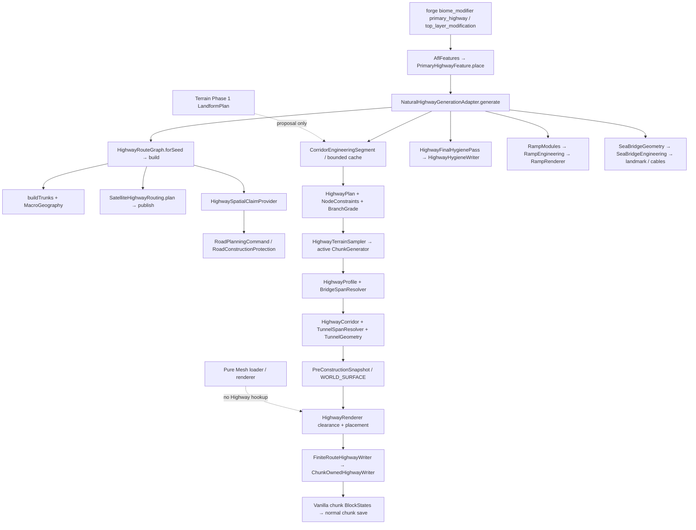

# Highway V2-0：现有架构审查与冻结边界

日期：2026-10-07。基线：`5dc68bbc2f1960aa685ba11d5f9a7cd5c985367c`，Minecraft 1.20.1 / Forge 47.4.22。开始时工作树干净。本报告由当前源码、构建配置、资源入口审查形成；历史文档只用于辨别历史验证范围。

状态：**只读源码审查完成；隔离离线工具链原型完成；正式 Highway V2 改造未开始。** 未修改 Java、Gradle、live worldgen、RouteGraph、Terrain Phase 1/2、Road V1-B、既有资产或注册 ID。没有运行 Gradle、客户端、世界施工或全套测试。全国系统的运行质量不能由此次审查判定 PASS。

配套：[设计契约与后续工作包](highway_v2_0_design_contract.md)、[原型及复现](highway_v2_0_mesh_prototype.md)。旧名称中已有 Highway V2 Phase 1/2A/2B，与此次 M1–M5 **不是同一阶段编号**。

后续增量：[M1-A隔离开发测试场](highway_v2_m1a_mesh_sandbox.md)已新增dev Java/资源和Gradle隔离配置，编译与离线检查通过；M1-A 已集成 Master，基础渲染/坡面行走已获用户确认，生命周期与光影兼容仍待验收。本页“未改Java/Gradle”等为V2-0的历史范围。正式RouteGraph、Highway施工、Terrain与Road V1-B仍未修改；旧审查不能充当M1-A实机结果。

## 1. 真实结构与调用链

下文 `main/` 指 `src/main/java/com/antaurora/apofirstlight/`，`dev/` 指 `src/dev/java/com/antaurora/apofirstlight/`。除特别注明，Highway 类位于 `worldgen/highway/`。

入口资源实际为 `src/main/resources/data/apocalypse_firstlight/forge/biome_modifier/primary_highway.json`，通过 biome tag `primary_highway_generation` 添加 placed feature，在 `top_layer_modification` 阶段执行；configured feature 对应 `registry/AflFeatures.PRIMARY_HIGHWAY`。`world/feature/PrimaryHighwayFeature.place` 调用适配器。适配器只处理主世界 `WorldGenRegion`，以 `region.getCenter()` 为施工 chunk，并在远离路网时先快速退出。

### 路线权威

- `main/worldgen/highway/HighwayRouteGraph.java:51` 的 `forSeed → build` 是自然 Highway、claims、网络查询的共享 seed 权威。`buildTrunks` 恰好生成两条 `NATIONAL_TRUNK_A/B`，共享非原点交点；Route / Edge / Node、父 attachment、稳定 ID 均仍有效。
- **当前完整图不只有两条边。** `build:63–65` 还调用 `SatelliteHighwayRouting.plan`，`publish` 发布有限卫星支线及桥头；`seaCrossings` 再驱动海桥。自然支线使用 `OrthogonalHighwayPath` 分出的轴向 edges、TURN / JUNCTION 模块；可选 POLYLINE API 也保留。不能以旧“默认只有两条主干”的文档删掉后续成果。
- 主干终点 `terminus:174–196` 按每格里程、完整 ±32 横断面检查 MAINLAND/LAND，第一次宏观海岸即停止，再退 32 格、按 8 格采样相位对齐。`coreFits` 的 “infinite axis lines” 注释仅表示离 spawn 的直线距离，不是无限生成器。
- 在现行 Highway main/dev 源目录检索未发现旧 `2200±300` 网格生成；旧 `PrimaryHighwayNetwork` / `HighwayGenerationContext` 不存在于现行入口。跨海延伸目前是有约束的支线/桥梁，而非轴向路无限穿海。其他数值 `300` 出现在受限海峡候选长度，不应误判旧网格仍生效。
- `/afl highway_test` 的 `dev/.../HighwayDebugCommand → HighwayPlan.main / HighwayProfile.sample → HighwayRenderer.render` 是独立开发局部施工器；不发布全国路线。它不是自然路网第二权威，但与自然施工复用大量工程代码，使用范围必须明确。

### 工程、施工、资源、保存

| 层 | 真实实现及边界 | 当前结论 |
|---|---|---|
| 几何 | `HighwayPlan.linear/ribbon`；`HighwayGeometry` 八方向直腿、仅 45° 转向、32 格边缘过渡；`OrthogonalHighwayPath` 用于卫星支线 | 有可复用投影/里程/查询/栅格化；不是连续曲率公路线形 |
| 全局工程窗口 | `CorridorEngineeringSegment` core=256，halo=192，ENGINEERING_VERSION=4；route/edge/segment/version 缓存键 | 保留随机访问与全局 station，相邻窗口仍要实测 |
| 地形与标高 | `HighwayTerrainSampler.globalRoadY` 512 格锚点，锚点用 ±256/±128/0 横断面中值按 1/2/3/2/1 加权；整数线性插值。Profile 每 8 格采样 | 当前实际 generator/baseHeight/baseColumn，不用 LandformPlan；没有通用设计速度/竖曲线约束 |
| 工程类型 | `HighwayTerrainMode` 实际枚举 GROUND/CUT/FILL/VIADUCT/TUNNEL；先 Profile/BridgeSpanResolver，再 Corridor/TunnelSpanResolver | 方案中的 SURFACE 是前三种的统称，不是当前 enum 名 |
| 占地 | 图 FOOTPRINT_HALF_WIDTH=20（查询宽41），CONSTRUCTION_HALF_WIDTH=32（预留宽65）；有限 writer 再裁剪 | claims 与路线同源，但不等于每次落块已完成保护裁决 |
| 自然施工 | 交叉路先共享施工前快照，低层段在高层段前；Renderer 清 ROW、核心上空、挖方，然后地基/路面/边缘/护栏/标线/隧道/桥墩 | 快照捕获是读源一致性工具，不是事务回滚或所有权证明 |
| 限写 | `ChunkOwnedHighwayWriter.owns/set`、`FiniteRouteHighwayWriter`；hygiene 也限定中心 chunk，并先 ensureCanWrite | 已有跨 chunk 写边界，应保留；不是保护任意人工方块的完整策略 |
| 匝道/海桥 | `HighwayRampModules/Engineering/Renderer`、`SeaBridgeEngineering` 已被自然适配器调用 | 不能列为未实现；工程 READY 与最终实机接受有区别 |
| 视觉 | 当前 HighwayRenderer **写方块**；asphalt、concrete、slab、road markings 走普通 blockstate/model；海桥钢索另有 Forge OBJ | 不调用 AflMeshRenderer；类名 Renderer 不代表已有道路 Mesh 渲染 |
| 缓存/重载 | `NaturalHighwayCacheManager` 每 server session/dimension/seed/generator/RandomState；segment 上限24、height65536、column16384、anchor2048、node256；卸载/停服释放 | 图按 seed 重建，工程缓存不持久化；已落块随原版 chunk 保存，没有 Highway 专有 SavedData/逐段版本账本 |

旧世界不会因脚本重导出或 Java 更新自动重铺。算法版本改变后新旧区块可能接不上；现行 ENGINEERING_VERSION 是缓存隔离，不能替代存档生成版本治理。

## 2. dev Java 编译和发布边界

`build.gradle:28–43` 声明独立 dev sourceSet，同时 `sourceSets.main.java.srcDir 'src/dev/java'`。Forge run 的 mod 使用 main output。`jar:346–347` 只排除包路径 `com/antaurora/apofirstlight/dev/**`。

因此位于 dev 文件夹但包名为 `com.antaurora.apofirstlight.worldgen.highway` 的 Plan/Profile/Corridor/Renderer/Tunnel 等，会进入 main 编译且不受该 jar 排除项影响。这些是现行自然入口的实际依赖，不能删除 dev 目录来“清理旧实现”。`AflDevCommands` 位于被排除包，开发命令入口和工程库发布边界并不相同；`HighwayNetworkCommand` 在 main 包，以 Forge subscriber 注册只读网络命令。

建议 M1 的独立维护小包将**被生产调用的工程类**按原包名移入 main；开发命令、编辑会话和测试统计工具经依赖审查后再隔离。这不是 V2-0 原型前置条件。本轮不迁移。风险：双 sourceSet 重复类、删错自然链依赖、包扫描变化、发布缺类、dev command 包外辅助类仍进 jar。迁移要另做 compile/package 内容检查，保持行为不变，不能和全国几何重写绑在一起。此次只核对构建规则，未制造/检验新的 jar。

## 3. 隧道与清障：证据分级

| 事项 | 已证实源码事实 | 尚不能据此断言 |
|---|---|---|
| 隧道预检 | SpanResolver 使用样本覆土、水覆盖、两侧地形、节点 tunnelAllowed、最短长度；普通覆土8、长度40、portal4；深挖提升另有覆盖和长度规则 | 这不是全体 bore/shell voxel 的岩石完整性、洞穴、流体、建筑归属预检 |
| 截面 | `HighwayTunnelGeometry` 低部 bore ±12（25宽）、shell ±13（27宽）、portal ±14（29宽）；顶逐层收窄，内高8，顶衬到roadY+9，portal顶+10 | 不可把清障保护 area 的33宽当作33宽净空；外侧最高净空小于中心8 |
| 常数耦合 | geometry 中低部±12、±13和各拱顶宽度为硬编码，虽有 MAIN_WIDTH 派生常量 | 仅把 MAIN_WIDTH 改38会导致错误；必须参数化整套横断面和包络 |
| 开口/围岩 | tunnel area 排除露天清障；placeTunnel 仅 clear 规划 bore，再写 shell/portal；最终 hygiene 只扫描 tunnel bore | 无世界证据不能宣称所有入口悬空、漏天或残石问题已修复；也不能据此宣称现在必然复现某处旧截图 Bug |
| 坡度 | 依赖 Profile 整数 roadY；TunnelGeometry 使用初始 tangent。POLYLINE 遇隧道候选会 geometryDeferred，不施工该窗口 | 不支持任意曲线隧道；没有符合设计速度的专用隧道竖曲线求解器 |
| 保护失败 | `HighwayRenderer.clear:758` 仅跳过 block entity 和 destroySpeed<0；clearRow、clearCut、core clearance 可以清普通固体 | 普通 stone/log/grass 的 ID 不证明天然，也不能保证玩家建筑不被清理 |
| 部分写入 | 核心遇保护障碍累计 failure 后继续；放置 writer 主要保护 block entity，普通道路/地基直接 set；没有整段 all-or-nothing 预检 | 若障碍在净空中，静态可推导有残留且仍继续施工的路径；未在世界复现其具体数量 |
| hygiene | 清理 replaceable/flowers/vine/dirt 系、LOGS/LEAVES；BFS 上限1024，水平10/垂直24；访问限制现已归中心 chunk | 能分类材质，不能分类人工树/泥土建筑。大树跨块尾部和后续 feature 顺序仍需实机 |
| 范围保护 | 地图有限、中心 chunk 限写、snapshot WORLD_SURFACE 并向上诊断8格 | 不能替代自然结构/模组建筑/玩家/既有道路的 provenance |
| 海桥失败 | `SeaBridgeEngineering.ready()` 看 corridor，状态 PARTIAL_FOUNDATION_FAILED 仍可能渲染有路面的部分桥梁 | 不应把所有非 READY 当整段拒绝；未验证缺墩桥视觉和行为 |

**证实的能力缺口**：通用所有权保护、全截面岩体预检、失败前整体拒绝、真实连续纵坡/任意曲线隧道、持久版本治理。**待复现实机疑点**：portal跨段错位、顶衬漏缝、后生植被、保护残块影响、跨窗口 tunnel 判定变化。此次不修这些 live 逻辑。

V2 的清障契约应为：已验证自然生成上下文 + 完整 claims/结构排除 + 前置快照 + 写前状态对比 + 有限预算，任何 UNKNOWN、玩家修改、已知模组/自然结构、他路所有权冲突均保守拒绝整段。自然阶段首次施工与已加载区块手动改建分开授权；仅凭 baseColumn 相同也不足以证明玩家未摆相同方块。需世界修改台账或同等可信来源，不能创建“stone 白名单即安全”的捷径。

## 4. 45°、标线、护栏和 seam：保留范围

`HighwayGeometry.point/tangent` 沿直腿选择，拐点切向会变；Patch 对侧边/miter 做32格插值，并不是圆曲线或缓和曲线。保留其有限投影、空间索引、4邻接 footprint、chunk union、全局里程标线相位和测试夹具；正式主线连续线形另建后端，不能把45°折线包装为曲率连续。

当前护栏多为 concrete edge/slab parapet/中央 slab，斜向保留栅格化边缘处理；`RoadMarkingBlock`、riser connector、Ramp 边界型状态继续有效。无需在本轮删模型、重做 Claude 的护栏艺术。主线自然部分、支线局部 TURN/JUNCTION、开发对角线路要分别验收。

`src/test/java/.../worldgen/highway/HighwayGeometryTest` 含有限路径、4连通、无洞和 chunk union；`HighwayGeometryIntegrationTest` 含真实 Corridor、grade、marking、viaduct及tunnel no-write；另有 Ramp/Viaduct/RouteCost/SeaBridge/Phase1Snapshot 等夹具。**本轮仅阅读，不重跑 Java 测试**。历史对角/高架文档记录编译和无世界契约测试；匝道文档明确2026-09-21用户否定早先视觉结论，随后只有固定坐标内存回放，未获新实机 PASS。

`NaturalHighwaySeamValidator` 只在已有相邻缓存段的两个边界 station 比较标高/mode、标线相位、桥隧、节点；不会主动生成邻段，也不是逐体素/光照/所有横断面 seam 的验证器。应保留并扩大测试观测，不当作跨 chunk 已全量通过。

## 5. Mesh / 物理 / 选择 / 交互

- 当前 Pure Mesh 为 `client/mesh/AflMeshLoader → AflMeshModel/Part → AflMeshRenderer`；几何仅有 `[x,y,z,u,v]`，加载时产生面法线，无可输入平滑顶点法线或独立 tangent 字段。用户附带这些字段会被严格拒绝。
- `meshshape/AflMeshShapeBlock` 分开调用 physical VoxelShape、selection VoxelShape、interaction regions；`AflMeshShapeProfile` 有64盒、16区域、4竖向cell等限制。`meshhit` 三角拾取和客户端选框是另一路。它们都不会使视觉三角形自动成为车辆物理斜面。
- 普通 Highway 方块仍有自己的 Vanilla/AFL collision；样段没有碰撞资源或方块注册。单个256米 BER 加一个 AABB 不能构成合理碰撞或剔除方案。
- 建议道路地基/步行碰撞用有限块状态或经预算的分片 VoxelShape；连续车辆接触走未来 `RoadSurfaceQuery`，给出 road/version、station、lateral、height、normal、lane/material、有效状态。多层互通需 elevation hint / previous roadId，不能仅按XZ返回唯一高度。视觉分辨率、碰撞精度、交互锚点分别设预算。此接口尚未接入游戏。

## 6. Pure Mesh 工具链核查

| 能力 | 当前实现 | V2-0结论 |
|---|---|---|
| `.mjs` 定位 | `export-afl-mesh.mjs` 严格 Free Model转换/导出；`cube-slab-mesh-lib.mjs` 参数 extrude/revolve/box/UV；`lathe-mesh-lib.mjs` 和材料/设备 builders 批生产 | 是混合工具链；能先直接构造顶点/面 Free Model对象，再复用 convert，不需第二格式 |
| 文件 | `.aflmesh.json`，format_version 1/2；V2.1 是保守拓扑策略版本，不是 format_version=2.1；本轮未发现需要新二进制`.aflmesh` | 继续格式2；没有格式扩展 |
| 坐标/预算 | bone_pivot_local_blocks、16作者单位/格、CCW、top_left；位置各轴绝对值≤256，UV每轴0..1；128parts、65536存储顶点、16384等效三角形；Loader文本4MiB字符 | 世界长路必须局部原点/窗口；不得把世界坐标直接塞入sidecar |
| 材质/UV | 一个导出纹理atlas；part render_layer=cutout/translucent；geometry的纹理尺寸必须匹配；UV必须有且非退化才有有效切线 | 名称分组不等于多材质自动绑定。本原型5槽共用atlas，4m里程周期在边界切UV |
| Quad | `triangulate/classifyQuad` 保留原剖分对角线；真实扭曲、凹面、UV手性/导数不连续回退Triangle；仅自身量化误差允许保守恢复 | 曲线/超高/竖曲线不得强制合Quad；复用现有转换器 |
| Loader附加合并 | Loader当前另有 `pairTriangles`，共享索引、法线点积>1-1e-6、UV导数相对1e-3、同手性才合并；不等于源精度分类器 | 本次原型实载比导出少166对Triangle；等效三角形不变。PBR细微面法线效果仍需实机，未改共享规则 |
| 渲染 | CPU经VertexConsumer写QUADS：Quad=ABCD，Triangle=ABCC；支持当前pose、反射/法线矩阵和分层；不等于GPU instancing | 统计submitted corners而非只数Triangle；part数不能直接当draw calls |
| 资源 | `AflMeshCache` reload扫描assets/*/meshes/*.aflmesh.json，与同stem geo/*.geo.json对应，按geometry ResourceLocation缓存不可变snapshot | 当前为资源重载集合，无道路动态分片LRU/GPU缓存或LOD系统 |
| Facing/入口 | `AflAnimatedBlockMeshRenderer` profile + host/BER；原点方块底心，horizontal facing规则N0/E-90/S180/W90；另有Gecko骨骼路径 | 可以复用核心提交方法；不把每一米路变成独立动画BlockEntity |
| 光照/兼容 | BER传入一个packedLight到部件，opaque entityCutoutNoCull；透明涉及主动flush/阴影跳过和发光补画；既有AflShaderCompat属通用现有路径 | 数百米道路需分区光照/剔除。PBR纹理命名、shader tangent、透明排序、depth、重复纹理mipmap边缘需独立验收 |

未修改枪械、办公资产、共享 exporter/loader/renderer。Oculus/Embeddium 配置或既有资产的成功记录不构成道路兼容证明；没有运行兼容或 FPS benchmark。

## 7. Terrain Phase 1 与 Road V1-B

`worldgen/terrain/plan/LandformPlan` 为纯 seed 宏观规划，`field/targetHeight/sample` 可提供 landmass、landform、连续权重、河道距离/目标高程、适宜性、64格坡度和256格稀疏起伏；规划导出为32格 grid。`targetHeight` 是目标顶层地面方块Y，不是当前 `getBaseHeight` 的首空气Y，也不是可直接施工标高。未接入 density 或 Highway，不能用适宜性 HIGH 推断真实洞穴/岩体/claims通过。

未来接口需同时传 `planVersion/terrainGenerationVersion/seed`、datum（groundBlockY、surfaceY=groundBlockY+1）、采样分辨率、COMPLETE/UNKNOWN、river/water/landmass/slope。工程阶段仍需当前生成器细采样与现场保护。Terrain Phase 2 切换实际高程后再标定 Highway，Phase 3 的地下/生态处理后复测清障与地基。合理地貌不能为了维持旧轴向线强行拉平。

`RoadConstructionProtection.query` 已使用 HighwaySpatialClaimProvider，也查启动区/bunker/authoring；但 **Highway writer 不反向调用它**。旧 Rural 已退役，不再描述为活跃协调者。Road V1-B 保留，其当前文档明确用户实机 FAIL、无自然入口；此次不修它、不降低 void/cut/fill 保护。后续共享安全查询契约可适配，不能把 Road 工程器和 Highway 互相当后门。

## 8. 保留 / 适配 / 替换 / 退役，按风险与投入排序

| 优先级/投入 | 模块 | 决策 | 理由/准入条件 |
|---|---|---|---|
| P0 / 小 | finite RouteGraph、Route/Edge/Node、父attach、spawn/coast规则 | 保留 | 唯一路线拓扑权威；几何升级不丢ID/有限边界 |
| P0 / 小 | chunk writer、snapshot、bounded cache、station相位、固定seed夹具 | 保留/适配 | 可复用边界；新版本键、量化和geometry窗口后复测 |
| P0 / 中 | 清障材质推断和非事务施工 | 替换其安全决策层 | 先完整拒绝后写；不触碰不可证实的非玩家方块 |
| P0 / 中 | 23/29/33与claims/节点/桥头/隧道常数 | 适配 | 所有层共同升级；不能单改MAIN_WIDTH |
| P1 / 中 | 512锚点整数标高、硬45°主线 | 新连续几何/纵断面替换正式主线后端 | 旧实现保持可选V1及对比夹具，非立即删除 |
| P1 / 小 | `.mjs`导出、AflMeshLoader、通用提交与三角保守规则 | 保留 | 此次原型无兼容扩展即可加载 |
| P1 / 中 | 道路分片渲染、光照、碰撞、surface query | 新建隔离适配层 | 目前没有道路Mesh生产入口；禁止枪械/机器范围重写 |
| P1 / 中 | dev工程库路径 | 适配迁移 | 维护依赖方向，另做发布检查，不是目录清洗 |
| P2 / 大 | 隧道、桥、钢索/桥塔、Ramp工程 | 保留成果/参数化适配 | 跨chunk、桥头、支撑、净空和正式艺术需逐模块验收 |
| P2 / 小 | 旧无限网络及2200网格叙述 | 退役描述，保留历史快照 | 当前入口已没有这些生产类，不能二次“删除”不存在代码 |
| P3 / 待后续验收 | V1栅格renderer/老模型/旧开发测试 | 暂不退役 | M5固定seed性能/视觉/回滚验收后才决定 |

本轮冻结基线commit与以上可复用边界；没有删除可运行旧V1，也没有新增开关假装已能在世界中自由切换版本。今后的可回滚实现应保留V1代码路径和新世界版本选择，不能仅靠回退代码保证混合存档安全。
